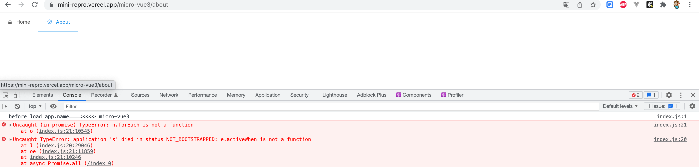

# micro-base-dva

## 项目概述 
利用 qiankun 实现前端微服务，主应用 micro-base-dva
* dva ^1.2.1   
* react ^15.4.2   
* atool-build ^0.9.3
* qiankun ^2.6.3
* 在 /micro-vue3/* 路由页面加载微应用
* 独立仓库，独立部署，独立域名：https://mini-repro.vercel.app/

## 启动

```bash
nvm use 8.16.1
npm ci
npm run start
```
访问 http://localhost:8989/

## 遇到的问题
开发环境正常，生产环境首次加载子应用页面就报错，如下所示:   
* 生产环境 bug 截图 



* 生产环境演示 gif 


* 开发环境演示 gif 


